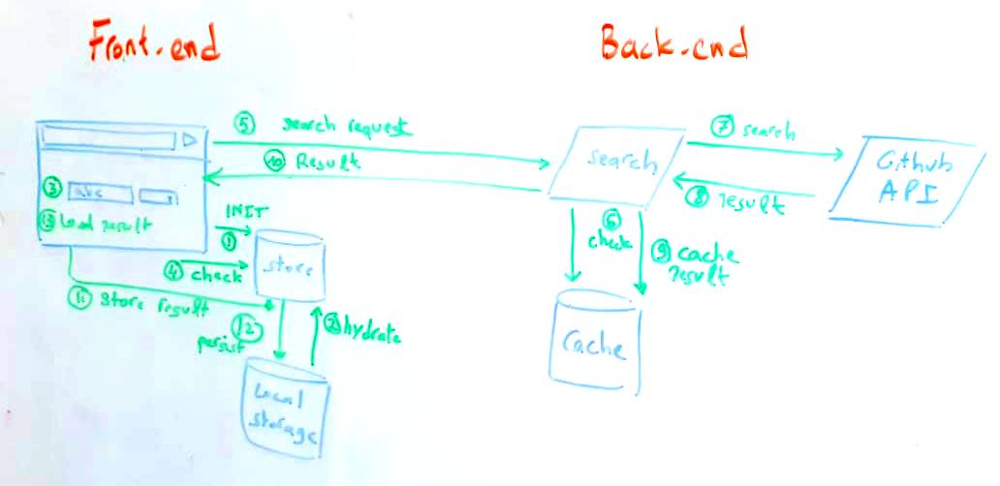

# Github searchers 

This is my solution for [Tradeling](https://www.tradeling.com/) Full-stack [coding task](https://github.com/tradeling/coding-tasks/blob/develop/fullstack-javascript/readme.md)
The goal is to build a SPA that allows users to search for specific users or repositories.
The solution uses Github Search API to execute users' queries.


## Pre-requisite
- redis `v6.0.6`
- node `v12.16.2`


## Try it yourself
This project is already deployed in the cloud using [Vercel](https://vercel.com)
You can access latest version [here](https://github-searchers-vercel.app)

P.S. This deployment is using fake github client for demo purpose. You need to install the project locally to see results from Github Search API. You can force using the real client by setting `GITHUB_USE_FAKE_CLIENT` to `0`

You can check the API documentation [here](github-searchers.vercel.app/_apidoc)


## Installation

To install this project in your machine, you need first to clone the project using `git` command.
Once project is cloned, head to `github-searchers` directory and install dependencies

```bash
$ yarn
```

Once all dependencies are installed, you can run the project using this command
```bash
$ yarn dev
```

## Solution
The below diagram illustrate the overall architecture of the solution and describe a typical user interaction.



When the user head to the website, the browser will download assets and start executing the javascript to initialize the app, which includes store initialization (step 1) and rehydaration, aka loading search history, (step 2).

When the user initiate search request (step 3), the frontend will do the following:
 1. check if we have a search result matching the request (step 4)
 1. If not, the frontend will hit the `/api/search` (step 5)
 1. The backend will check if the result is already cached (step 6)
 1. If nothing was found in the cache (step 7), the backend will fetch the result from Github (step 8)
 1. Then, it will cache the result for future request. By default, the result will be cached for 2h (step 9)
 1. The backend will process the result and return it to the frontend (step 10)
 1. Frontend will update the related store `user` or `repository` (step 11)
 1. Persist the store (step 12)
 1. Visualize the returned serach results by updating the `search` state (step 13)

### Backend
The search api fetch results from github if and only if the result is not available in cache. This is achived by decorating the respective method with the `cache` decorator

`/api/clear-cache` clear the cache by calling the `flushdb` redis command. This is assuming that we don't have any other data in the same redis db. This is the recommended way as running `KEYS` or `SCAN` command is not recommended in production. However, I implemented `delKeysStartsWith` api which able to delete keys starting with given prefix

### Frontend
I created a generic `FlexGrid` to present the search results. This component is responsive and can work properly in different screens. Even this was not mentionned in the requirement, but I belive this is a better approach.

Github serach results is stored is redux, under `user` or `repository` states. As the schema is the same, I created a generic slice maker.

#### Search Flow
1. user initiate search
1. Update `search` state with user query
1. If the result is already cached (aka exists in the `user` or `repository` state), return it from the store
1. Otherwise, fetch the data from the search API
1. Once the backend respond, check the `search` state
1. Update the related search result history, aka `user` or `repository` states
1. persist the store
1. If the response matches the latest search request, update the search result: `search` state


## Features
### Done
- Integration with Github Search API
- Search Results are cached for 2h by default, you can customize by updating `CACHE_TTL` environment variable
- Supported Github entities: `users` and `repositories`
- Persist search results in local storage using `redux-persist`

### TODO
1. Add support for pagination
2. Support other Github entities
3. Improve interface for `apiResponse` middleware
4. Add support of dynamic cache key prefix to prevent clearing the cache using `delKeyStartsWith` method
5. Run unit tests as part of CI/CD, see this [issue](https://github.com/vercel/vercel/discussions/5140)


## Configuration
This application follow [12-factor-app](https://12factor.net/) methodology. Hence, you can configure it by updating environment variables.

You can find below list of all supported environment variables

|Name                   | Type        | Enum          | Default     | Description                   |
|-----------------------|-------------|---------------|-------------|-------------------------------|
|CACHE_HOST             | string      |               | "127.0.0.1" | Cache server host             |
|CACHE_PORT             | number      |               | 6379        | Cache server port             |
|CACHE_TTL              | number      |               | 6379        | Default TTL for cached values |
|USE_GITHUB_FAKE_CLIENT | boolean     | "on" / "off"  | false       | Cache server port             |


For further details about availables configuration check <a href="shared/config.ts">shared/config.ts</a>


## Known Bugs
You can see list of all open issues [here](https://github.com/benzid-wael/github-searchers/issues/)

